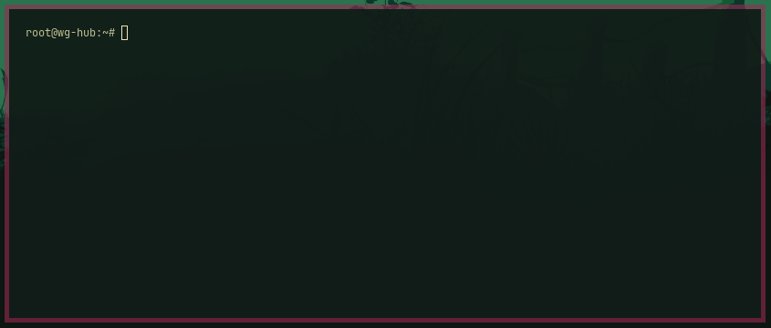

# Remote Terminal Indicator



A small 45° corner tint on any Omarchy terminal that has a remote session
open. The color is derived from the destination IP, so a given machine
always gets the same mark — on every window, after every reconnect.

It watches terminal titles (`user@host: cwd`) and paints a folded corner on
the top-right of the window. When the remote session ends, the mark
disappears and the theme border is left alone.

Works with Foot, Ghostty, Kitty, Alacritty, WezTerm, and anything Hyprland
tags as a terminal.

## Install

```sh
omarchy plugin add https://github.com/nova-centauri/omarchy-remote-terminal-indicator.git --enable
```

The shell picks it up without a restart. To force a rescan:

```sh
omarchy-shell shell rescanPlugins
```

## Use

SSH as you already do. The terminal title has to look like a remote shell:

```
you@prod-db: ~
you@staging:/var/www
root@10.0.0.12:~
```

Foot, Ghostty, and the usual prompt-title setups already emit that. Local
titles (`you@your-laptop: ~`) are ignored.

Inspect live sessions:

```sh
omarchy-shell io.github.nova-centauri.remote-terminal-indicator status
omarchy-shell io.github.nova-centauri.remote-terminal-indicator refresh
```

## Configure

Optional keys on the `plugins[]` entry in `~/.config/omarchy/shell.json`:

```json
{
  "id": "io.github.nova-centauri.remote-terminal-indicator",
  "cornerSize": 26
}
```

`cornerSize` is the folded-corner size in pixels. Default is `26`.

Host → IP mappings are cached in
`~/.cache/omarchy-remote-terminal-indicator/hosts` so a given hostname keeps
the same color even if DNS is slow next time.

## Remove

```sh
omarchy plugin remove io.github.nova-centauri.remote-terminal-indicator
```

Open remote terminals lose the corner mark as the plugin unloads. The
Hyprland theme border is not changed.

## License

MIT. See [LICENSE](LICENSE).
